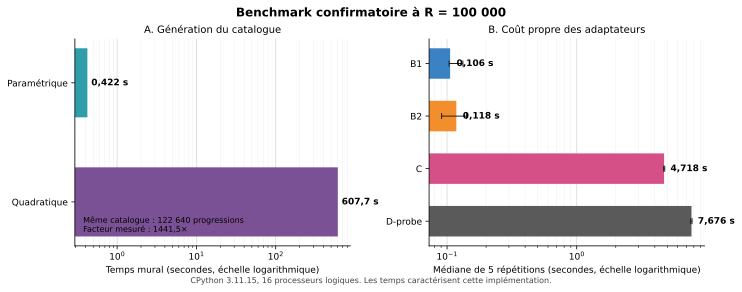

# Quatre formulations du problème du carré magique de carrés : comparaison de leur intérêt algorithmique

**Mustapha Rherrad (Mystimath)**<br>
ORCID : [0009-0003-5681-6412](https://orcid.org/0009-0003-5681-6412)

_Version 1.0 — 17 juillet 2026_

## Table des matières

- [Résumé](#resume)
- [1. Introduction](#section-1)
- [2. Définitions, notations et domaine](#section-2)
- [3. Forme centrée du carré magique](#section-3)
- [4. Les quatre formulations](#section-4)
- [5. Portée exacte des transformations](#section-5)
- [6. Paramétrisation des progressions](#section-6)
- [7. Noyau de validation](#section-7)
- [8. Méthodologie expérimentale](#section-8)
- [9. Résultats du catalogue](#section-9)
- [10. Résultats confirmatoires des formulations](#section-10)
- [11. Compteurs structurels](#section-11)
- [12. Analyse de la formulation A](#section-12)
- [13. Analyse de B1 et B2](#section-13)
- [14. Analyse de C](#section-14)
- [15. Analyse de D](#section-15)
- [16. Inventaire et réutilisation logicielle](#section-16)
- [17. Limites et statut des résultats](#section-17)
- [18. Recommandations](#section-18)
- [19. Conclusion](#section-19)
- [20. Reproductibilité](#section-20)
- [Références](#references)

<a id="resume"></a>

## Résumé

Nous étudions, du point de vue algorithmique, quatre formulations exactes du
problème du carré magique 3×3 de neuf carrés parfaits positifs et distincts,
encore ouvert dans la littérature évaluée par les pairs : recherche directe à
partir de trois carrés de base (A), progressions arithmétiques de carrés (B),
triangles rectangles rationnels de même aire (C) et points rationnels sur les
courbes elliptiques `E_n : y²=x³-n²x` associées aux nombres congruents (D).
Nous distinguons la formulation mathématique,
l'algorithme qui l'exploite et son implémentation. La comparaison repose sur un
validateur exact commun, trois moteurs entiers, deux adaptateurs de
transformation et un protocole reproductible en CPython.

À la borne commune `R=100000`, les deux générateurs construisent le même
catalogue de 122 640 progressions. Le générateur paramétrique primitif l'obtient
en 0,421561 s, contre 607,693954 s pour l'oracle quadratique exhaustif, soit un
facteur mesuré de 1441,53. Avec catalogue partagé, les médianes sur cinq
répétitions sont de 0,105599 s pour B1, 0,117933 s pour B2, 4,717564 s pour C
et 7,676005 s pour D-probe. Ces quatre adaptateurs produisent le même ensemble
vide dans cette boîte. B2 teste 24,02 fois moins de paires que B1, sans avantage
temporel stable dans cette implémentation.

Parmi nos prototypes, B constitue le meilleur cadre entier exhaustif, A reste
un oracle de validation, C fournit surtout une interprétation géométrique, et D
offre un cadre de découverte théorique et de construction qui ne se réduit pas
au benchmark entier dépendant de B. Aucun de ces résultats bornés ne tranche le
problème d'existence.

**Mots-clés :** carrés magiques de carrés ; progressions arithmétiques ;
nombres congruents ; courbes elliptiques ; calcul arithmétique exact.

<a id="section-1"></a>

## 1. Introduction

On cherche une grille magique 3×3 dont les neuf entrées sont des carrés
parfaits strictement positifs et deux à deux distincts. Les trois lignes, les
trois colonnes et les deux diagonales doivent avoir la même somme. L'existence
d'une telle grille demeure ouverte dans la littérature évaluée par les pairs ;
ce travail ne prétend ni résoudre ce problème ni démontrer une non-existence
globale. Rome et Yamagishi [15] ont démontré en 2025 l'existence de carrés
magiques de carrés pour tout ordre `k≥4`, tout en traitant encore le cas `k=3`
comme non résolu.

Une prépublication récente de Hill [7], dont la version 3 date du 7 avril 2026,
revendique une preuve de non-existence pour l'ordre 3. Nous ne tenons pas cette
revendication pour établie : son passage final compare les coefficients
d'expressions en un paramètre, alors que l'égalité obtenue auparavant ne vaut
que pour des valeurs arithmétiques fixées ; aucune identité polynomiale dans ce
paramètre n'est démontrée. En l'absence d'une justification de ce passage ou
d'une validation indépendante, le présent manuscrit conserve donc le statut
de problème ouvert.

Le problème remonte à Lucas, qui le pose en 1876 [11]. Il est formulé de nouveau
par LaBar en 1984 [9], puis popularisé par Gardner en 1996, comme le rappelle
le panorama historique de Boyer [1]. Robertson [14] le reformule ensuite à
l'aide de progressions arithmétiques de carrés, de triangles rectangles
rationnels de même aire et de points rationnels divisibles par 2 sur les
courbes elliptiques. Nous comparons ici l'intérêt algorithmique de ces
reformulations, auxquelles s'ajoute la forme centrée classique de Lucas [12]
(§3).

Notre question est la suivante : quelles formulations conduisent aux espaces
intermédiaires et aux structures de recherche les plus favorables ? Les seuls
chronométrages ne suffisent pas à y répondre, car ils dépendent du langage, des
bibliothèques, des structures de données, des caches et de l'ingénierie. Nous
distinguons donc trois niveaux :

1. la formulation mathématique ;
2. l'algorithme choisi pour l'exploiter ;
3. son implémentation concrète.

Nos conclusions portent d'abord sur la croissance des espaces, le nombre
d'objets et de relations, la certification de l'exhaustivité et la facilité de
validation. Les temps ne caractérisent que nos prototypes et les bornes testées.
Le Tableau 4 (§17.3) précise le statut de chaque résultat annoncé.

<a id="section-2"></a>

## 2. Définitions, notations et domaine

### 2.1 Tableau des notations

Le tableau suivant fixe, pour l'ensemble du manuscrit, la signification de
chaque symbole et le lieu de sa première définition.

| Symbole | Signification | Première définition |
| --- | --- | ---: |
| `R` | Borne : plus grande racine entière positive autorisée dans la grille finale | §8 |
| `x, y, z` | Racines entières positives des trois carrés de base d'un triplet candidat (A) ; `x²` est aussi le centre de la grille dans la forme centrée | §3, §4.1 |
| `p, q` | Décalages `p=x²-y²`, `q=x²-z²` autour du centre `x²` | §3 |
| `r, s` | Amplitudes positives `r=|p|`, `s=|q|`, à permutation des paires opposées près | §4.2, §5 |
| `D_x` | `{d>0 : x²-d et x²+d sont des carrés}` | §4.2 |
| `u, v, w` | Racines d'une progression `u², v², w²` de différence commune `n` ; `v²` est le terme central | §4.2–4.4 |
| `a, b` | Entiers premiers entre eux paramétrant `u²+w²=2v²` | §6 |
| `n` (indice de `E_n`) | Différence commune `n=v²-u²=w²-v²` de la progression, aussi dite nombre congruent associé | §4.4 |
| `E_n` | Courbe elliptique du nombre congruent `n`, d'équation `y²=x³-n²x` | §4.4 |
| `P, Q` | Points rationnels sur `E_n` | §4.4, §15 |
| `7/9`, `8/9` | Nombre de cases carrées d'une grille 3×3 déjà magique | §2.2 |

Remarque de notation : `n` désigne exclusivement, dans tout le document, la
différence commune d'une progression et l'indice de la courbe `E_n`. La
littérature classique (paramétrisation d'Euler d'une progression de carrés)
note souvent par `(m,n)` les deux entiers premiers entre eux qui engendrent
cette progression ; nous les notons ici `(a,b)` (§6) afin d'éviter toute
collision avec ce `n`-là. C'est le seul renommage de variable retenu dans ce manuscrit ; il ne
modifie aucun résultat, seulement sa lisibilité.

### 2.2 Domaine, primitivité et contrôles 7/9–8/9

Une solution admissible est une grille de neuf entiers positifs distincts,
tous carrés, dont les huit lignes standard ont une somme commune. Les contrôles
`7/9` et `8/9` comptent les cases carrées d'une grille déjà magique ; ils ne
doivent pas être confondus avec le nombre de lignes égales d'une grille
semi-magique.

Deux grilles sont identifiées sous le groupe diédral `D4` d'ordre 8. Les 72
opérations obtenues par permutations indépendantes des lignes et colonnes et
transposition ne préservent pas nécessairement les diagonales ; elles ne sont donc pas utilisées pour réduire le problème magique complet
modulo les symétries. Une grille
est primitive si aucun facteur carré entier supérieur à 1 ne divise globalement
ses neuf valeurs.

<a id="section-3"></a>

## 3. Forme centrée du carré magique

Tout carré magique 3×3 peut être écrit autour de son centre `x²`. Dans la
notation de cette étude :

```text
y²                    3x²-y²-z²          z²
x²-y²+z²              x²                 x²+y²-z²
2x²-z²                -x²+y²+z²          2x²-y²
```

Posons

```text
p=x²-y²,   q=x²-z².
```

Les neuf valeurs sont alors `x²` entouré des décalages

```text
±p, ±q, ±(p+q), ±(p-q).
```

Cette forme générale — centre `c` et décalages `±α, ±β, ±(α+β), ±(α-β)` pour un
carré magique 3×3 quelconque, dont notre écriture ci-dessus est le cas
`c=x², α=p, β=q` — est établie par Lucas [12, p. 224–225]. La correspondance
avec notre écriture est exacte, terme à terme, après réintroduction du centre
`x²`. Elle est aussi redérivée sous forme matricielle par Nordgren [13,
éq. (4)]. La collation de la source et la distinction avec le « carré à deux
degrés » traité par Lucas à partir de la p. 226 sont exposées au §17.2 et
synthétisées dans le Tableau 4 (§17.3).

Cette écriture additive relie directement la recherche aux progressions de
trois carrés centrées en une même valeur (§4.2).

<a id="section-4"></a>

## 4. Les quatre formulations

### 4.1 A — Trois carrés de base

A énumère les `R³` triplets `(x,y,z)` de racines comprises entre `1` et `R`,
construit les six expressions forcées, puis rejette toute valeur non positive
ou absente de l'ensemble `{1²,...,R²}`. Ainsi, une expression forcée dont la
racine dépasse `R` est éliminée avant même la validation finale. La couche
commune d'acceptation contrôle ensuite les neuf cases et leur racine maximale
(§7–§8).

Le compte `R³` mesure donc les triplets de base proposés, non un domaine où
seules trois des neuf racines seraient bornées. Cet oracle volontairement
simple est cubique en `R`, transparent et utile aux petites bornes, mais devient
rapidement prohibitif.

### 4.2 B — Progressions arithmétiques de carrés

Pour un centre carré `x²` (§3), définissons

```text
D_x={d>0 : x²-d et x²+d sont des carrés}.
```

B1 cherche `r=|p|` et `s=|q|` dans `D_x` — à une permutation des paires
opposées près — tels que `r+s` et `|r-s|` appartiennent aussi à `D_x`. B2 groupe
plutôt les progressions par différence commune, puis cherche trois centres
carrés en progression. Les deux
indexations reconstruisent les mêmes grilles, mais leurs collisions
intermédiaires diffèrent.

### 4.3 C — Triangles rectangles de même aire

Une progression rationnelle

```text
u², v², w²,   u²+w²=2v²
```

correspond au triangle rectangle

```text
(w-u, w+u, 2v).
```

En effet,

```text
(w-u)²+(w+u)²=2(u²+w²)=(2v)²,
aire=(w-u)(w+u)/2=v²-u².
```

Réciproquement, pour des côtés rationnels `A<B` et une hypoténuse `C`, on
retrouve `u=(B-A)/2`, `w=(B+A)/2` et `v=C/2`. Trois progressions de même
différence deviennent donc trois triangles de même aire dont les carrés des
hypoténuses sont en progression. Robertson [14] établit cette correspondance ;
Bremner [2] étudie directement des familles de triangles pythagoriciens de
même aire au moyen d'une surface quartique. La traduction ajoute toutefois
fractions, normalisation et gestion des similitudes.

### 4.4 D — Courbes elliptiques associées aux nombres congruents

À une progression de différence `n`, avec
`v²-n=u²` et `v²+n=w²`, est associé le point

```text
P=(v²,uvw) sur E_n : y²=x³-n²x.
```

L'appartenance à la courbe se vérifie directement :

```text
v²(v⁴-n²)=v²(v²-n)(v²+n)=u²v²w².
```

Le critère de 2-descente relie ensuite les trois carrés `v²-n`, `v²` et
`v²+n` à la condition `P∈2E_n(Q)`. Le problème devient la recherche de trois
points de `2E_n(Q)` dont les abscisses sont en progression arithmétique. Cette
équivalence est établie par Robertson [14] et reprise par Bremner [3, §1] ; elle
est sourcée ici, mais non redémontrée intégralement (Tableau 4, §17.3).

Contrairement au D-probe entier utilisé dans le benchmark commun, une recherche
elliptique autonome exige rang, générateurs, hauteurs et énumération certifiée.
Le chapitre I de Koblitz [8] organise le passage des nombres congruents (p. 3) à
l'équation cubique (p. 6), puis aux courbes elliptiques (p. 9). Pour les
hauteurs naïves et canoniques, voir Silverman [16, chap. VIII, §9] ; le calcul du
groupe de Mordell–Weil est traité au chap. X du même ouvrage.

<a id="section-5"></a>

## 5. Portée exacte des transformations

Nous précisons d'abord l'équivalence entière A ≡ B1 ≡ B2. Dans toute grille
admissible de centre `x²`, la forme du §3 donne quatre paires opposées de
décalages. Si `r=|p|` et `s=|q|`, leurs quatre amplitudes positives sont, à
l'ordre près,

```text
r, s, r+s, |r-s|.
```

Elles appartiennent toutes à `D_x`. La grille fournit donc un couple testé par
B1. Réciproquement, si `r,s,r+s,|r-s|∈D_x`, les huit valeurs symétriques autour
de `x²` sont des carrés ; la construction centrée redonne une grille magique,
puis le validateur impose positivité, distinction et primitivité éventuelle.
A et B1 couvrent ainsi le même domaine final, à symétrie `D4` près.

L'équivalence avec B2 est le même fait réindexé. Fixons `r`. Les conditions
`r,s,r+s,|r-s|∈D_x` signifient exactement que les trois carrés

```text
x²-s, x², x²+s
```

sont les centres de trois progressions de carrés ayant la même différence
`r`. B2 groupe ces progressions par `r`, puis cherche leurs trois centres en
progression de différence `s`. La construction inverse restitue les quatre
amplitudes de B1. B1 et B2 énumèrent donc les mêmes grilles, avec des collisions
intermédiaires différentes.

La borne est elle aussi identique : A teste ses six valeurs forcées dans
`{1²,...,R²}` ; les catalogues B ne contiennent que des progressions dont les
racines sont au plus `R` ; enfin, la couche commune d'acceptation rejette toute
grille dont l'une des neuf racines dépasse `R` (§7–§8). Les `R³` triplets de A
sont un nombre de propositions, non une extension de la boîte finale.

Les correspondances B–C et B–D, établies dans la littérature [3, 14], sont des
équivalences rationnelles non dégénérées après normalisation, mais leurs bornes
naturelles ne sont pas préservées. Une hauteur elliptique ne correspond pas
directement à `max_root<=R`, et une borne sur les triangles ne définit pas
automatiquement la même boîte de grilles.

Nous séparons donc deux pistes : exhaustivité dans une boîte entière pour A–B,
et rendement de découverte ou pouvoir constructif dans le domaine naturel de
C–D. Le benchmark C/D présenté ici (§10, Tableau 2) mesure le coût
d'adaptateurs appliqués au catalogue entier B ; il ne classe pas une recherche
elliptique autonome.

<a id="section-6"></a>

## 6. Paramétrisation des progressions

L'équation `u²+w²=2v²` est paramétrée, à permutation et signes près, par

```text
a²+2ab-b²,   a²+b²,   -a²+2ab+b².
```

Le problème classique du *congruum*, qui revient à chercher trois carrés en
progression arithmétique, apparaît déjà dans le *Liber Quadratorum* de
Fibonacci [6, prop. 14].

Les entiers premiers entre eux sont notés `(a,b)` plutôt que `(m,n)` afin
d'éviter toute collision avec l'indice `n` de la courbe `E_n` (§2.1).
L'identité algébrique entre les carrés des trois expressions est immédiate.
Réciproquement, une progression rationnelle non constante donne le point
`(U,W)=(u/v,w/v)` du cercle `U²+W²=2`. La droite rationnelle passant par
`(1,1)` fournit tous les autres points rationnels du cercle ; après
homogénéisation de sa pente et réduction, on obtient les trois expressions
ci-dessus. Toute progression entière primitive non dégénérée apparaît donc,
après prise des valeurs absolues, permutation et division par leur PGCD commun ;
les autres sont ses dilatations entières [5].

Pour `pgcd(a,b)=1`, le PGCD des trois racines brutes vaut `1` ou `2`. Si `g`
désigne ce PGCD, `a²+b²` est l'une de ces racines et la progression réduite
contient `(a²+b²)/g`. Une progression admissible ayant toutes ses racines au
plus `R` vérifie donc

```text
a²+b² <= gR <= 2R.
```

La borne de parcours `a²+b²<=2R` est ainsi suffisante ; elle est volontairement
généreuse, puis les candidats dont la plus grande racine dépasse `R` sont
filtrés.

L'énumération implémentée n'est pas injective. Elle
parcourt tous les couples ordonnés positifs premiers entre eux, sans restriction
de parité ni condition `a>b`, normalise les trois valeurs, puis stocke leur
signature triée dans un ensemble. L'échange `(a,b)↔(b,a)` et la transformation
d'un couple impair-impair en `((a+b)/2,|a-b|/2)` produisent notamment des
représentations répétées ; par exemple, `(2,1)` et `(3,1)` donnent tous deux la
progression primitive de racines `(1,5,7)`. Le cas constant `(1,1)` et les cas
nuls sont rejetés par les tests de positivité et d'ordre strict. Le temps publié
pour le générateur paramétrique inclut donc le coût de ces représentations et de
leur déduplication.

L'ancien oracle quadratique est conservé comme voie indépendante. La couverture
générale vient de la paramétrisation rationnelle ; séparément, l'égalité des
listes triées est un contrôle borné de l'implémentation, vérifié objet par objet
jusqu'à `R=100000` sur 122 640 progressions (§9).

<a id="section-7"></a>

## 7. Noyau de validation

Le validateur générique utilise exclusivement l'arithmétique entière exacte et
`math.isqrt`. Il recalcule carrés, racines, huit sommes, positivité,
distinction, primitivité et clé canonique `D4`. La couche commune
`accept_grid`, appelée par A, B1, B2, C et D-probe, calcule ensuite les neuf
racines et rejette explicitement la grille si leur maximum dépasse `R`. Dans A,
un premier filtre équivalent intervient déjà lorsque les six valeurs forcées
sont testées dans `{1²,...,R²}`.

Le carré de Bremner [3, p. 290] à sept cases carrées est accepté comme contrôle
positif 7/9, mais rejeté comme 8/9 et 9/9. Les cas nuls, répétés, non magiques et
les dilatations sont testés séparément.

La suite finale contient 31 tests couvrant aussi les transformations
progression–triangle, progression–point, le certificat de 2-descente, l'accord
A–B à petite borne et l'injection du catalogue partagé.

<a id="section-8"></a>

## 8. Méthodologie expérimentale

La borne `R` désigne la plus grande racine positive autorisée parmi les neuf
cases de la grille finale. Tous les moteurs explorent cette même boîte, soit par
construction du catalogue, soit au moyen du filtre final de `accept_grid`
(§7). Les mesures pilotes utilisent `R=50,75,100`, puis les prétests complets
portent sur `R=1000,5000,10000,25000,50000`. L'expérience confirmatoire retient
la borne unique `R=100000`.

Le catalogue est construit une fois, puis injecté dans B1, B2, C et D-probe.
Chaque adaptateur est exécuté cinq fois dans un ordre cyclique, inversé une
répétition sur deux. Nous publions le minimum, la médiane et le maximum. Les
ensembles canoniques sont comparés objet par objet. À la borne confirmatoire,
l'oracle quadratique complet contrôle indépendamment le catalogue
paramétrique.

Les temps à six décimales sont reproduits tels qu'enregistrés dans les
artefacts afin d'en assurer la traçabilité ; ce nombre de décimales ne constitue
pas une revendication de précision métrologique.

L'environnement principal est Windows `10.0.26200`, avec CPython 3.11.15
64 bits, un processeur Intel64 Family 6 Model 167 et 16 processeurs logiques.
Les contrôles elliptiques utilisent Ubuntu 24.04 sous WSL2, SageMath 10.9,
Python 3.12.13 et PARI/GP 2.15.4.

<a id="section-9"></a>

## 9. Résultats du catalogue

À `R=100000`, les deux générateurs produisent exactement 122 640 progressions.

**Tableau 1.** Temps de construction du catalogue de progressions (`R=100000`).

| Générateur | Temps mural (s) | Statut |
| --- | ---: | --- |
| Quadratique | 607,693954 | complet |
| Paramétrique primitif | 0,421561 | complet |

Le facteur d'accélération mesuré est 1441,53 (Tableau 1). Cette amélioration
appartient au générateur commun (§6) et ne doit pas être attribuée à B1 ou B2
séparément.

<a id="section-10"></a>

## 10. Résultats confirmatoires des formulations

Lors de l'exécution principale à catalogue partagé, la construction paramétrique du
catalogue prend 0,395904 s. Il s'agit d'une exécution distincte du contrôle
croisé du Tableau 1, où le même générateur prend 0,421561 s.

**Tableau 2.** Temps d'exécution des adaptateurs sur catalogue partagé (borne
confirmatoire `R=100000`, cinq répétitions).

| Adaptateur | Minimum (s) | Médiane (s) | Maximum (s) |
| --- | ---: | ---: | ---: |
| B1 | 0,103635 | 0,105599 | 0,132432 |
| B2 | 0,090774 | 0,117933 | 0,141048 |
| C | 4,678045 | 4,717564 | 4,772368 |
| D-probe | 7,555667 | 7,676005 | 7,749274 |

Les ensembles finaux produits par B1, B2, C et D-probe sont exactement égaux
et vides. Cette absence est
exhaustive dans la boîte entière définie par `R=100000`, non au-delà (statut
détaillé au Tableau 4, §17.3).



**Figure 1 —** Benchmark confirmatoire à `R=100000`. Le panneau A compare les
deux générateurs du même catalogue ; le panneau B isole le coût propre des
adaptateurs après partage du catalogue. Les axes temporels sont logarithmiques.
Les barres d'erreur du panneau B représentent le minimum et le maximum des cinq
répétitions autour de la médiane. Ces temps caractérisent l'implémentation et la
machine documentées, non les formulations mathématiques en elles-mêmes.

<a id="section-11"></a>

## 11. Compteurs structurels

**Tableau 3.** Compteurs structurels par formulation (`R=100000`).

| Formulation | Regroupement | Nombre de groupes | Relations testées (paires) | Correspondances complètes |
| --- | --- | ---: | ---: | ---: |
| B1 | centres | 55 791 | 238 294 | 0 |
| B2 | différences | 114 267 | 9 920 | 0 |
| C | aires | 114 267 | 9 920 | 0 |
| D-probe | valeurs de `n` | 114 267 | 9 920 | 0 |

B2 teste 24,02 fois moins de paires que B1 (Tableau 3). Pourtant B1 est
légèrement plus rapide en médiane dans cette implémentation (Tableau 2), et les
plages minimum–maximum observées se recouvrent. Nous n'établissons donc pas de
supériorité temporelle intrinsèque entre B1 et B2. L'avantage structurel de B2 demeure
clair et pourrait devenir décisif dans une autre implémentation ou dans un
domaine où les collisions seraient plus nombreuses.

<a id="section-12"></a>

## 12. Analyse de la formulation A

A fournit le chemin le plus direct entre les variables mathématiques et la
grille (§4.1). À `R=100`, le benchmark instrumenté examine un million de
triplets de base en 17,196251 s. Cet essai, distinct des Tableaux 1–3, est mené
à une borne beaucoup plus petite ; B n'y indexe que 37 progressions. À
`R=100000`, A devrait examiner exactement `10^15` triplets et n'a donc pas été
exécutée.

Ce nombre de triplets est une extrapolation combinatoire exacte, mais nous
n'en extrapolons aucun temps d'exécution. A conserve néanmoins deux fonctions
utiles : oracle simple à petite borne et support de validation croisée pour les
filtres locaux.

<a id="section-13"></a>

## 13. Analyse de B1 et B2

B est le meilleur cadre de recherche entière exhaustive dans notre étude
(§4.2). Sa paramétrisation (§6) réduit radicalement l'espace initial et sa
borne se traduit directement en domaine final certifiable. B1 offre une
indexation intuitive par centre ; B2 minimise les relations testées par
groupement de différence (Tableau 3).

Leur proximité temporelle (Tableau 2) illustre une limite essentielle : le
compteur asymptotique ou structurel ne détermine pas seul le temps d'une
implémentation. Les tables de hachage, allocations et constantes Python
peuvent inverser un classement sur des adaptateurs très courts.

<a id="section-14"></a>

## 14. Analyse de C

C (§4.3) reproduit exactement les sorties de B2, mais sa médiane vaut 44,7 fois
celle de B1 et 40,0 fois celle de B2 après exclusion du temps de
construction du catalogue (Tableau 2). Ce surcoût provient des objets
`Fraction`, de la construction de 122 640 triangles, de leur normalisation et
des clés de similitude. Dans cette boîte, C ne réduit pas davantage le nombre
de collisions (Tableau 3).

Dans notre prototype, C n'apparaît donc pas comme le meilleur moteur exhaustif
primaire. Elle reste utile pour l'interprétation géométrique, le contrôle des
transformations et la conception éventuelle de familles où l'aire constitue
une variable naturelle.

<a id="section-15"></a>

## 15. Analyse de D

Le D-probe (§4.4) construit 122 640 points rationnels, vérifie leur
appartenance aux courbes et produit autant de certificats exacts de trois
carrés. Son coût médian est de 7,676005 s (Tableau 2). Il dépend toutefois du
catalogue B et ne constitue pas une recherche elliptique indépendante.

SageMath confirme que `E_24` a rang 1, que son groupe de torsion a pour
structure `[2,2]` et que `P=(25,35)` possède quatre moitiés rationnelles,
dont `Q=(72,576)`. Sur `E_6`, le point de contrôle `P=(12,36)` appartient à
la courbe mais n'est pas divisible par 2. Ces propriétés sont vérifiées par
calcul formel, sans que leur démonstration soit reproduite ici (Tableau 4,
§17.3).

Les articles de Bremner de 1999 et 2001 portent sur deux relaxations distinctes
du problème. En 1999 [3, p. 290–294], Bremner consigne la grille 7/9 de la
p. 290 ; son étude principale concerne des grilles dont les neuf entrées sont
carrées et dont sept des huit sommes sont égales. Il mobilise déjà un point
d'ordre infini sur une courbe définie sur `Q(λ)`, ses multiples, des familles
paramétrées, une fibration elliptique et une borne de rang issue de la formule
de Shioda (p. 292–293).

En 2001 [4, §2–§4, p. 291–307], il examine les seize configurations possibles
de six cases carrées dans une grille pleinement magique. Les surfaces obtenues
sont des intersections de trois quadriques dans `P^5` ; les cas non singuliers
relèvent des surfaces K3. L'article étudie leurs fibrations elliptiques, leurs
rangs et des points d'ordre infini afin de construire des familles
paramétrées. La configuration III fait l'objet de l'analyse K3 détaillée du §3
(p. 298–305).

Ces travaux illustrent pourquoi D doit être évaluée à partir des rangs
certifiés, de la hauteur canonique [16, chap. VIII, §9], des combinaisons de
générateurs et du rendement de découverte, et non seulement par sa vitesse
dans la boîte entière de B.

<a id="section-16"></a>

## 16. Inventaire et réutilisation logicielle

Le dépôt contenait des moteurs historiques à centre carré ou non carré, des
chaînes d'exécution B2 avec reprise et partitionnement, des journaux de
campagnes 7/9–8/9 ainsi que des outils semi-magiques de validation et
d'archivage. Nous en avons repris les principes de test exact, de réduction
modulo les symétries, de comptage et de gestion des manifestes. Un noyau
indépendant a toutefois été créé afin de ne pas valider un générateur par sa
propre logique.

Les calculs historiques à plus grande profondeur restent distingués des
benchmarks présentés ici. Une déclaration documentaire dépourvue de manifeste
complet n'est pas considérée comme une preuve de couverture.

<a id="section-17"></a>

## 17. Limites et statut des résultats

### 17.1 Limites

- Les chronométrages proviennent d'une seule machine et de CPython.
- Les répétitions partagent un processus ; l'ordre alterné réduit mais n'annule
  pas les effets de cache.
- Le pic mémoire total du processus n'est pas mesuré de façon robuste.
- B1, B2, C et D-probe partagent le même catalogue final ; C et D ne sont donc
  pas des générateurs indépendants dans le benchmark entier.
- Le moteur D autonome par hauteur n'est pas implémenté.
- Une borne de racines n'est pas comparable à une borne de hauteur elliptique.
- L'ensemble final vide limite la validation croisée positive à des objets
  intermédiaires et aux contrôles 7/9.

Ces limites n'invalident pas les identités, l'égalité exacte des catalogues, les
compteurs structurels ni l'exhaustivité dans les boîtes explicitement définies.

### 17.2 Statut de l'attribution à Lucas

L'attribution à Lucas de la forme générale du carré magique (§3) repose sur
la collation directe des pages 224–225 de [12]. Lucas soustrait
d'abord le centre commun, obtient une forme à deux paramètres après avoir montré
que le terme central réduit est nul, puis pose `b+c=2p` et `b-c=2q`. Il écrit
p. 225 le carré centré

```text
-p      p+q     -q
p-q      0      q-p
 q      -p-q     p
```

et énonce le critère en trois progressions arithmétiques. En réintroduisant le
centre `x²` et en posant `p=x²-y²`, `q=x²-z²`, les neuf cases coïncident terme à
terme avec la forme du §3. Nordgren [13, éq. (4)] en donne une dérivation
matricielle indépendante et renvoie correctement aux p. 224–225.

La p. 226 ouvre un développement voisin mais distinct sur les « carrés à deux
degrés », dont les entrées et leurs carrés doivent simultanément former des
carrés magiques. Le « Tableau des neuf quantités » qui y figure est lui-même
repris par Lucas de sa *Théorie des nombres* (1891). Cette page ne doit donc pas
être utilisée comme source de la forme centrée du §3 ni confondue avec le
problème d'une grille dont les neuf entrées sont des carrés parfaits.
Nordgren renvoie ainsi au développement pertinent des p. 224–225, tandis que
le renvoi de Boyer à la p. 226 pointe vers le sujet voisin. Cette distinction
explique la divergence entre les deux renvois sans supposer l'existence de
tirages différents.

La référence [11] reste la source de 1876 pour l'origine du problème du carré
magique *de carrés*, antérieure au problème de LaBar [9] et à sa popularisation
ultérieure, comme le rappelle Boyer [1]. La référence [10], authentique ouvrage
de Lucas sur l'analyse indéterminée, demeure une référence générale mais
n'atteste pas la forme centrée employée ici.

Ces vérifications étayent donc l'attribution de la forme générale. Séparément,
la lecture de [11, p. 97–101] confirme que Lucas y pose explicitement
le défi de construire un carré magique de neuf carrés ; l'origine de 1876 du
problème ouvert est ainsi directement attestée.

### 17.3 Tableau de statut épistémique

**Tableau 4.** Statut épistémique des principaux résultats du manuscrit.

| Résultat | Nature | Statut | Renvoi |
| --- | --- | --- | ---: |
| Forme centrée d'un carré magique d'ordre 3 | Identité algébrique | Établie directement par Lucas [12, p. 224–225] ; correspondance terme à terme collationnée et corroborée par Nordgren [13] | §3, §17.2 |
| Équivalence A ≡ B1 ≡ B2 (domaine entier, borne commune) | Identité / bijection | Démontrée par les deux réindexations du §5 ; implémentée avec une borne sur les neuf racines et contrôlée par les 31 tests | §5, §7 |
| Équivalence progressions ↔ triangles ↔ points rationnels divisibles par 2 sur `E_n` | Équivalence mathématique | Établie dans la littérature [3, 14] ; identités élémentaires vérifiées ici, critère de 2-descente non redémontré | §4.2–4.4, §5 |
| Couverture de la paramétrisation des progressions | Paramétrisation rationnelle | Déduite du cercle `U²+W²=2` [5] ; l'implémentation déduplique ses représentations multiples | §6 |
| Catalogue paramétrique = catalogue quadratique à `R=100000` | Fait empirique et contrôle exact | Vérifié objet par objet dans la boîte testée ; pas un théorème général | §9, Tableau 1 |
| Facteur d'accélération 1441,53× | Mesure de temps | Empirique, dépendant de la machine et de CPython 3.11.15 ; comparaison relative seulement | §9, Tableau 1, §17.1 |
| Médianes B1/B2/C/D-probe | Mesures de temps | Empiriques, cinq répétitions, une seule machine | §10, Tableau 2, §17.1 |
| Compteurs structurels (groupes, paires testées) | Dénombrement exact | Exact pour l'implémentation et la borne données | §11, Tableau 3 |
| Ensemble final vide à `R=100000` pour B1, B2, C et D-probe | Recherche exhaustive bornée | Exhaustif dans la boîte de racine maximale `R=100000` ; ne dit rien au-delà | §10, §17.1 |
| Rang 1 et torsion `[2,2]` de `E_24` ; divisibilité par 2 de `P=(25,35)` sur `E_24` ; non-divisibilité par 2 de `P=(12,36)` sur `E_6` | Fait de géométrie arithmétique | Vérifié par calcul formel (SageMath 10.9, PARI/GP 2.15.4) ; reproductible via le script fourni (§20), non revu par les pairs ici | §15, §20 |
| Existence d'un carré magique 3×3 de neuf carrés distincts | Problème ouvert | Ouvert dans la littérature évaluée par les pairs [15] ; la revendication récente de non-existence [7] n'est pas retenue ici faute de justification de son passage final | §1, §19 |

<a id="section-18"></a>

## 18. Recommandations

Pour une recherche entière exhaustive, nous recommandons le catalogue
paramétrique commun (§6) et une indexation B. B2 est à privilégier lorsque le
nombre de relations ou la parallélisation importe, sans présumer d'un gain
temporel automatique (Tableau 2). A doit être conservée comme oracle indépendant
à petite borne (§4.1).

C devrait rester une couche géométrique ou un validateur, sauf si une
paramétrisation par aire réduit effectivement l'espace exploré. D appelle un
protocole autonome sous SageMath : sélection des courbes, certification des
groupes de Mordell–Weil, énumération sous hauteur canonique [16] et recherche
de progressions d'abscisses (§4.4, §15).

Une implémentation secondaire dans un langage compilé comme C++, Rust ou C
permettrait d'évaluer la stabilité du classement structurel. SageMath reste
approprié aux calculs elliptiques.

<a id="section-19"></a>

## 19. Conclusion

La comparaison ne désigne pas une formulation universellement « la plus
rapide ». Dans nos prototypes et aux bornes testées, B fournit le cadre le plus
efficace pour une recherche entière exhaustive et certifiable. A constitue un
oracle direct à petite borne. C apporte surtout une lecture géométrique et une
voie de validation. D possède le plus grand potentiel pour la découverte
théorique et la construction de familles, mais son domaine naturel requiert un
protocole distinct fondé sur les rangs, les générateurs et les hauteurs. Le
Tableau 4 (§17.3) précise la portée de ces affirmations.

Le résultat algorithmique le plus marqué est commun aux différentes
indexations entières : la paramétrisation du catalogue (§6) réduit le coût
dominant d'un facteur mesuré de 1441,53 à `R=100000` (Tableau 1). Dans la même
boîte, B1, B2, C et D-probe aboutissent au même ensemble vide. Ce constat
exhaustif borné ne fournit aucune conclusion au-delà de `R=100000` et ne
résout pas le problème d'existence, dont l'état actuel est discuté au §1.

<a id="section-20"></a>

## 20. Reproductibilité

Les scripts, tests, artefacts JSON et rapports se trouvent sous :

```text
experiments/formulations_comparison/
results/formulations_comparison/benchmarks/
docs/13-j0-scope-and-vocabulary.md
docs/15-j2-mathematical-equivalences.md
docs/22-j8-confirmatory-benchmark.md
```

Commandes essentielles :

```powershell
python -m unittest discover -s experiments\formulations_comparison\tests -v

python experiments\formulations_comparison\benchmark_shared_catalog.py `
  --bound 100000 --repetitions 5 --catalog-engine parametric `
  --output results\formulations_comparison\benchmarks\shared_catalog_parametric_r100000.json
```

Le contrôle SageMath se lance sous WSL2 avec l'environnement conda `sage` :

```bash
conda run -n sage python \
  experiments/formulations_comparison/sage_elliptic_probe.py
```

<a id="references"></a>

## Références

[1] C. Boyer, « Some notes on the magic squares of squares problem »,
*The Mathematical Intelligencer* 27(2), 52–64, 2005. DOI :
[10.1007/BF02985794](https://doi.org/10.1007/BF02985794).

[2] A. Bremner, « Pythagorean triangles and a quartic surface », *Journal für
die reine und angewandte Mathematik* 318, 120–125, 1980. DOI :
[10.1515/crll.1980.318.120](https://doi.org/10.1515/crll.1980.318.120).

[3] A. Bremner, « On squares of squares », *Acta Arithmetica* 88(3),
289–297, 1999. DOI :
[10.4064/aa-88-3-289-297](https://doi.org/10.4064/aa-88-3-289-297).

[4] A. Bremner, « On squares of squares II », *Acta Arithmetica* 99(3),
289–308, 2001. DOI :
[10.4064/aa99-3-6](https://doi.org/10.4064/aa99-3-6).

[5] K. Conrad, « Arithmetic progressions of three squares », note
pédagogique, University of Connecticut,
[en ligne](https://kconrad.math.uconn.edu/blurbs/ugradnumthy/3squarearithprog.pdf).

[6] Leonardo Pisano Fibonacci, *The Book of Squares (Liber Quadratorum)*,
trad. et annot. L. E. Sigler, Academic Press, Orlando (FL), 1987,
ISBN `978-0-12-643130-8`, proposition 14, p. 53–74.

[7] O. Hill, « On Arithmetic Progressions and a Proof of the Nonexistence of
Magic Squares of Squares », arXiv:2510.08286 [math.GM], version 3,
7 avril 2026, prépublication non évaluée par les pairs. DOI :
[10.48550/arXiv.2510.08286](https://doi.org/10.48550/arXiv.2510.08286).

[8] N. Koblitz, *Introduction to Elliptic Curves and Modular Forms*, Graduate
Texts in Mathematics 97, Springer-Verlag, New York, 1re éd. 1984, 2e éd. 1993.
DOI :
[10.1007/978-1-4684-0255-1](https://doi.org/10.1007/978-1-4684-0255-1).

[9] M. LaBar, « Problem 270 », *College Mathematics Journal* 15, 69, 1984.

[10] É. Lucas, *Recherches sur l'analyse indéterminée et l'arithmétique de
Diophante*, Desrosiers, Moulins, 1873 ; réimpression avec une préface de
J. Itard, Blanchard, Paris, 1961.

[11] É. Lucas, « Sur un problème d'Euler relatif aux carrés magiques »,
*Nouvelle Correspondance Mathématique*, tome 2, 1876, p. 97–101.

[12] É. Lucas, « Les carrés magiques : sur le carré de 3 et sur les carrés à
deux degrés », *Les Tablettes du Chercheur*, 1er mars 1891 ; reproduit dans
*Récréations mathématiques*, tome IV, « Note II », Gauthier-Villars, Paris,
1894, p. 224–228. La forme centrée citée au §3 se trouve p. 224–225.

[13] R. P. Nordgren, « Compound Lucas Magic Squares », arXiv:2103.04774
[math.GM], 2021. DOI :
[10.48550/arXiv.2103.04774](https://doi.org/10.48550/arXiv.2103.04774).

[14] J. P. Robertson, « Magic squares of squares », *Mathematics Magazine*
69(4), 289–293, 1996. DOI :
[10.1080/0025570X.1996.11996457](https://doi.org/10.1080/0025570X.1996.11996457) ;
JSTOR : [stable/2690537](https://www.jstor.org/stable/2690537).

[15] N. Rome et S. Yamagishi, « On the existence of magic squares of powers »,
*Research in Number Theory* 11, article 91, 2025. DOI :
[10.1007/s40993-025-00671-5](https://doi.org/10.1007/s40993-025-00671-5).

[16] J. H. Silverman, *The Arithmetic of Elliptic Curves*, Graduate Texts in
Mathematics 106, 2e éd., Springer, 2009. DOI :
[10.1007/978-0-387-09494-6](https://doi.org/10.1007/978-0-387-09494-6),
chap. VIII, §9, et chap. X.
